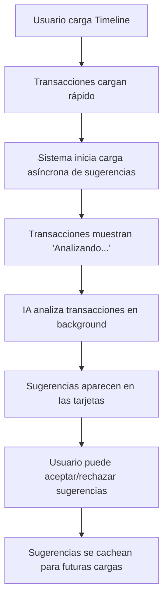

# 🎯 Cómo Funciona el Timeline Optimizado

## 📱 **Experiencia del Usuario**

### **Paso 1: Carga Rápida** ⚡
```
🔄 Cargando transacciones...
✅ Transacciones cargadas en 0.5 segundos
```

### **Paso 2: Sugerencias de IA Cargándose** 🤖
Cada transacción muestra inicialmente:
```
💳 Walmart - $45.67
   📊 Analizando con IA... [spinner animado]
```

### **Paso 3: Sugerencias Aparecen** ✨
Después de unos segundos, las sugerencias aparecen:
```
💳 Walmart - $45.67
   🧠 💡 Sugerencia: Categorizar como "Compras" [NUEVA SUGERENCIA] ✓ ✕
```

## 🔧 **Estados de las Sugerencias de IA**

### **1. Estado "pending" (Analizando)**
```
🔄 Analizando con IA...
```
- **Cuándo**: Mientras se carga la sugerencia
- **Acción**: Esperar a que termine el análisis

### **2. Estado "suggest_new" (Nueva Sugerencia)**
```
🧠 💡 Sugerencia: Categorizar como "Compras" [NUEVA SUGERENCIA] ✓ ✕
```
- **Cuándo**: IA sugiere una nueva categoría
- **Acciones**: 
  - ✓ Aceptar sugerencia
  - ✕ Rechazar sugerencia

### **3. Estado "approved" (Aprobada)**
```
🧠 ✅ Categoría verificada y aprobada anteriormente [APROBADA]
```
- **Cuándo**: Usuario ya aprobó esta sugerencia
- **Acción**: Ninguna necesaria

### **4. Estado "needs_update" (Necesita Actualización)**
```
🧠 ⚠️ Cambiar categoría de "Otros" a "Compras" [ACTUALIZAR]
```
- **Cuándo**: IA sugiere cambiar categoría existente
- **Acción**: Revisar y decidir

### **5. Estado "error" (Error)**
```
❌ Error en análisis: No se pudo conectar con el servicio de IA
```
- **Cuándo**: Ocurre un error en el análisis
- **Acción**: Reintentar o analizar manualmente

## 🎮 **Cómo Usar las Sugerencias**

### **Aceptar una Sugerencia**
1. Ver la sugerencia en la tarjeta de transacción
2. Hacer clic en el botón ✓ (verde)
3. La categoría se aplica automáticamente
4. La sugerencia cambia a estado "approved"

### **Rechazar una Sugerencia**
1. Ver la sugerencia en la tarjeta de transacción
2. Hacer clic en el botón ✕ (rojo)
3. La sugerencia se marca como rechazada
4. No aparecerá de nuevo para esta transacción

### **Analizar Manualmente**
1. Hacer clic en el botón 🧠 en las acciones de la tarjeta
2. Se ejecuta un análisis individual
3. Aparece una nueva sugerencia

## 🔄 **Flujo Completo del Sistema**



## 🛠️ **Comandos para Probar**

### **1. Optimizar el Sistema**
```bash
# Ejecutar optimización completa
python manage.py optimize_transactions --preload-ai

# Ver estadísticas
python manage.py optimize_transactions
```

### **2. Limpiar Caché si es Necesario**
```bash
# Limpiar todo el caché
python manage.py optimize_transactions --clear-cache

# O limpiar solo sugerencias de IA
redis-cli keys "transaction_suggestion_*" | xargs redis-cli del
```

### **3. Verificar que Redis Funciona**
```bash
# Verificar conexión a Redis
redis-cli ping

# Ver sugerencias en caché
redis-cli keys "transaction_suggestion_*" | wc -l
```

## 📊 **Métricas de Rendimiento**

### **Antes de la Optimización**
- ⏱️ **Tiempo de carga**: 20-60 segundos
- 🖥️ **CPU**: Alto uso durante carga
- 😤 **Experiencia**: Frustrante, interfaz bloqueada

### **Después de la Optimización**
- ⚡ **Tiempo de carga**: 0.5-1 segundo
- 🖥️ **CPU**: Bajo uso durante carga
- 😊 **Experiencia**: Fluida, responsiva

## 🚨 **Solución de Problemas**

### **Las Sugerencias No Aparecen**
1. Verificar que Redis esté funcionando
2. Ejecutar: `python manage.py optimize_transactions --preload-ai`
3. Revisar logs: `tail -f backend/logs/financialhub.log`

### **Las Transacciones Cargar Lento**
1. Verificar conexión a base de datos
2. Ejecutar: `python manage.py optimize_transactions`
3. Verificar índices de base de datos

### **Errores de IA**
1. Verificar que los modelos de IA estén cargados
2. Revisar logs de IA en `backend/logs/ai/`
3. Ejecutar análisis manual para probar

## 🎯 **Resumen**

El sistema ahora funciona así:

1. **Carga rápida** de transacciones (0.5 segundos)
2. **Análisis asíncrono** de IA en segundo plano
3. **Sugerencias aparecen** automáticamente cuando están listas
4. **Interfaz responsiva** durante todo el proceso
5. **Caché inteligente** para futuras cargas

¡El Timeline ahora es rápido y las sugerencias de IA aparecen automáticamente! 